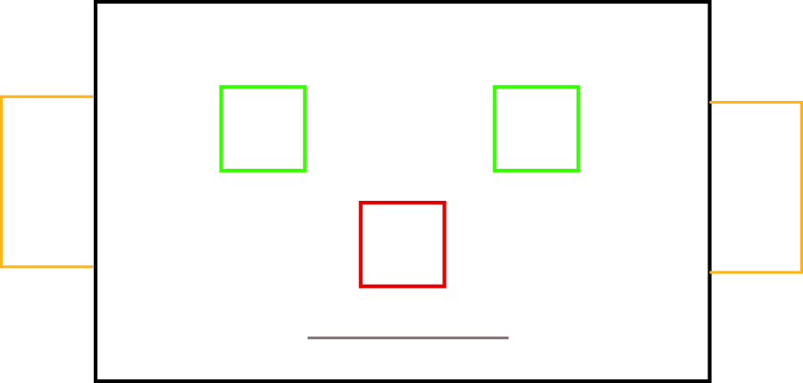
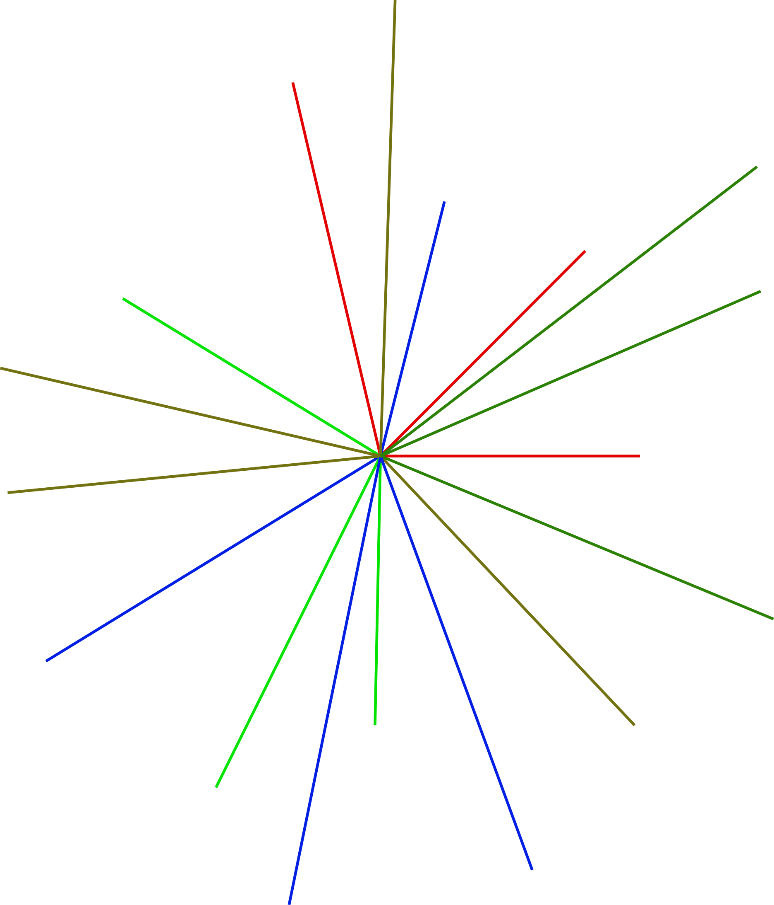
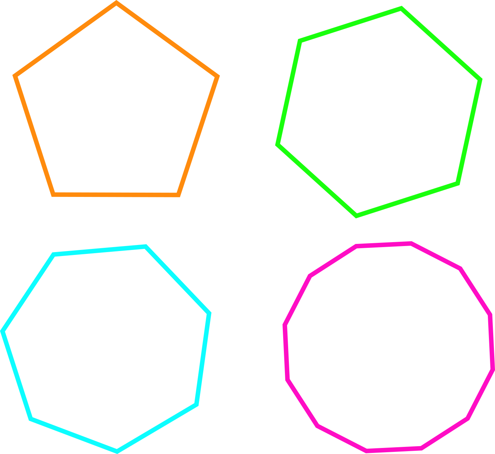

# Desenhando com números

## Aula 0 \(ZERO\)

### A nossa linguagem para falar com o computador

Para começar a desenhar com números é preciso primeiro entrar no programa que vai entender nossos comandos. Para isso é necessário digitarmos a linha de comando a seguir para carregar a linguagem de programação Python

```text
python
```

Agora estamos dentro do ambiente que consegue entender os nossos comandos. Mas tem ainda um pequeno detalhe. O Python é uma linguagem de programação que serve para um montão de coisas no mundo. Desde movimentar a tartaruga até ajudar o homem povoar outros planetas. Por isso ele não guarda tudo dentro dele, ele deixa guardado em algumas bibliotecas. 

Para começar a usar nossa 'tartaruga' vamos chamar a biblioteca que tem todos os comandos necessários.

> Vale lembrar que o Python é usado no mundo inteiro, e para facilitar a comunicação entre os programadores os comandos estão em Inglês. Portanto além de apreder a programar, você ainda vai aprender um pouco de inglês.

```text
import turtle
```

Pronto, agora nosso interpretador de Python já sabe alguns comandos que estão dentro dessa biblioteca. um deles serva para nos mostrar a tartaruga na tela. Estes comandos estão dentro da biblioteca e por isso que normalmente esses comandos aparecem depois do nome da biblioteca, no nosso caso turtle

```text
turtle.st()
```

Veja que um triangulo apontado para a direita apareceu na sua tela. Essa é a nossa tartaruga. Por enquanto, sempre que ela andar vai deixar o caminho desenhado.

Vamos fazer ela andar 50 passos, lembrando que ela sempre vai andar para onde estiver apontada. Ela pode andar para frente ou para trás. Lembra que os comandos são, na maioria das vezes em inglês? Algumas vezes eles também poder ser abreviações, como o comando que usamos anteriormente que 'Mostra a tartaruga', ou seja, 'Show Turtle'.

### Para frente, para trás, para esquerda e para direita

A palavra para frente em inglês é forward, portanto ...

```text
turtle.forward(50)
```

... vai fazer a tartaruga andar 50 posições na direção para onde ela está apontada.

Uma grande qualidade que deve está presente em qualquer bom programador é a preguiça. Tudo o que um bom programador faz é tentar fazer as coisas de uma maneira mais fácil, gastando menos energia e de forma mais simples. Portanto a biblioteca turtle tem uma abreviação para forrward\(\) ...

```text
turtle.fd(50)
```

.... ficou mais fácil?

Mas podemos querer que a tartaruga vá caminhe de volta para trás, a palavra em inglês nesse caso é backward\(\) ...

```text
turtle.backward(100)
```

... ou se vc já está começando a ficar preguiçoso ...

```text
turtle.bk(100)
```

Mas se ela ficar indo para frente e para trás continuamos sempre desenhando numa mesma linha, certo? Podemos usar comandos para a tartarua girar, e ela pode fazer isso para a direita, com a palavra right\(\) ou para a esquerda, com a palavra left\(\).

Mas quanto a nossa tartaruga pode girar para um lado ou para o outro. Para a frente ou para trás, sabemos que os numeros poderiam ser centímetros, metros, ou mesmo passos, certo? Mas quando vc tem que girar já pensou em que número usar?

Para saber o quanto girar uma determinada coisa podemos usar os graus. Os graus são quase como um relógio, mas ao invés dos minutos irem do 0 ao 60, os graus fazem um giro completo a cada 360 graus.

Então imagine um círculo bem redondinho. Se eu sei que a cada 360 graus eu dou uma volta nele, se eu girar 180 graus onde vou parar? Vamos testar?

```text
turtle.left(180)
```

Viu que a tartaruga deu meia volta? E se eu girar 360 para a direita agora?

```text
turtle.right(360)
```

Opa, não aconteceu nada? Aconteceu sim, mas lembra que eu disse que uma volta completa são 360 graus? Viu como estava certo? E qual a metade de 180? E se eu dividir 360 por 8 pedaços igual uma pizza? Faça as suas tentativas e tire suas conclusões? Essa é a melhor maneira de aprender?

Tente dividir os giro total do círculo por 3, e caminhe para frente com a mesma distância enquanto vc gira? Teste mudando esses números, quais as conclusões vc chegou?

Já imaginou quanta coisa é possível fazer apenas com 4 comandos?

> Se quiser parar nessa aula, já aprendeu bastante sobre muitas coisas que vão te ajudar muito. Mas imagine as coisas que ainda estão pela frente? Imagina poder escrever vários comandos e deixar o Python desenhar todos de uma vez enquanto vc fica só olhando?

## Aula 1

Hoje vamos aprender um pouco mais sobre o que a nossa tartaruga é capaz de fazer.

Primeiro, vc sabia que ela pode andar sem desenhar? É verdade, ela tem uma canetinha em baixo dela que pode estar pra baixo riscando ou para cima sem riscar. Na sua vida em computação você ainda vai ver muito disso. Por exemplo, ligado e desligado, verdadeiro ou falso, cheio ou vazio. 

A nossa tartaruga gosta muito de desenhar, por isso que a caneta dela já começa sempre para baixo \(down\), ou seja, o modo padrão dela é pronta para desenhar. Vamos relembrar para mostrar que ela já começa pronta para desenhar?

Vamos relembrar os primeiros passos para desenhar com programação:

1. Precisamos entrar no interpretador de comandos do computador
2. Depois precisamos chamar o interpretador que conhece a linguagem de programação Python
3. Agora como ele não sabe tudo, vamos pedir para que ele busque e carrega a biblioteca turtle
4. Prontinho, agora é só mostrar a nossa tartaruga na tela
5. E agora desenhar para frente \(forward\), para traz \(backward\), girar para direita \(right\) e girar para esquerda \(left\)

Agora vamos andar 50 passos para frente

```text
turtle.fd(50)
```

### Caneta para baixo, caneta para cima

Ela está com a caneta para baixo, certo? Vamos escrever um novo comando para que a tartaruga coloque a caneta para cima e fazer ela andar mais 50 passos para frente.

```text
turtle.penup()
turtle.fd(50)
```

Viu como é fácil o comando para fazer a tartaruga subir a caneta, pen é caneta e up é para cima. Vamos fazer ela ir para baixo de novo e desenhar mais 50 passos para frente. Tem alguma idéia de como deve ser o comando para descer a caneta? Isso mesmo ...

```text
turtle.pendown()
turtle.fd(50)
```

### Voltando para casa

Você já imaginou quantas possibilidades temos agora com apenas esses dois comandinhos? Mas a nossa tartaruga também sabe voltar para a casa sozinha. A casa dela é onde ela começa a sua caminhada quando abre a tela. O comando é o seguinte:

```text
turgle.home()
```

Se você sorriu com o resultado desse simples comando, está num bom caminho da programação. Esse é nosso trabalho, tentar dexar as coisas mais fáceis e fazendo as pessoas digitarem menos. Mas antes de começar o exercício de hoje vamos dar um colorido a mais no nosso desenho.

### Um pouco de colorido

Nossa tartaruga pode modificar a cor da caneta que ela está desenhando sabia? É verdade, e ela tem várias maneiras de fazer isso, uma delas é escrevendo o nome da cor em inglês. Você sabe o nomes de muitas cores em inglês? Eu gosto de "blue" e você, tente uma cor que você gosta e lembra no nome em inglês. Mas antes disso vamos apagar o desenho anterior

```text
turtle.clear()
```

Agora sim, vamos mudar a cor e desenhar alguma coisa. Mas antes disso é importante lembrar uma coisa. A nossa linguagem de programação tem muitas palavras que são seus comandos. Você ainda vai aprender que nós podemos criar comandos e nomes para muitas coisas. Mas quando queremos falar uma palavra que não é um comando ou instrução, como por exemplo uma cor, devemos coloca-la entre "aspas" assim o Python entende que aquilo é um nome e não uma instrução. Por isso que escrevemos turtle ou pencolor sem "aspas" mas colocamos o nome da cor "blue" entre "aspas"

```text
turtle.pencolor("blue")
turtle.fd(100)
turtle.pencolor(escreva aqui uma cor em inglês, não esqueça das "aspas")
turtle.fd(40)
```

Ficou bacana ou o Python não encontrou a sua cor? Não tem problema. Vou colocar aqui uma lista de cores que a biblioteca da turtle conhece:

|  |  |  |  | ​ |  |
| :--- | :--- | :--- | :--- | :--- | :--- |
| black | white | maroon | red | pruple | green |
| yellow | blue | orange | chocolate | darkblue | darkgreen |
| gold | grey | tomato | salmon | magenta | cyan |

O que achou da quantidade de cores? Nesse site aqui você pode encontrar muito mais cores:

{% embed data="{\"url\":\"https://developer.mozilla.org/en-US/docs/Web/CSS/color\_value\",\"type\":\"link\",\"title\":\"<color>\",\"description\":\"The color CSS data type represents a color in the sRGB color space. A color may also include an alpha-channel transparency value, indicating how the color should composite with its background.\",\"icon\":{\"type\":\"icon\",\"url\":\"https://developer.mozilla.org/static/img/favicon144.e7e21ca263ca.png\",\"width\":144,\"height\":144,\"aspectRatio\":1},\"thumbnail\":{\"type\":\"thumbnail\",\"url\":\"https://developer.mozilla.org/static/img/opengraph-logo.72382e605ce3.png\",\"width\":600,\"height\":600,\"aspectRatio\":1}}" %}

Não encontrou ainda? Então você pode criar a sua própria cor, são mais de 16 milhões de possibilidades de cor. Sabe quanto grande é esse número? Tenta imaginar ...

### Exercícios e desafio

Mas para criar a sua própria cor ainda vamos esperar um pouco mais. Por enquanto já temos bastante conhecimento novo para fazer um exercício bacana. Que tal começar a desenhar um robo?



Eu tenho certeza que com tudo o que você aprendeu consegue fazer um robo bem melhor que esse aqui de cima. Mas que tal experimentar vários angulos e cores e voltar sempre para a casa inicial da tartarua? Lembre que para dar a volta toda temos 360 graus, podemos ir para frente e para trás e podemos voltar para a casa que é onde tudo começou. O meu ficou assim:



Agora vou deixar um desafio para voce fazer, que tal? Você vai ter que pesquisar um pouco e pensar um pouco também. Você conhece os polígonos de lados iguais? Quais deles você conhece? O quadrado e o triangulo eu já sei que sabe quai mais? Pesquise outros polígonos de lados iguais e tente desenha-los. Lembre-se que ele tem todos os lados iguais, e cada volta de um circulo tem 360 graus. como então desenharia essas formas abaixo:



